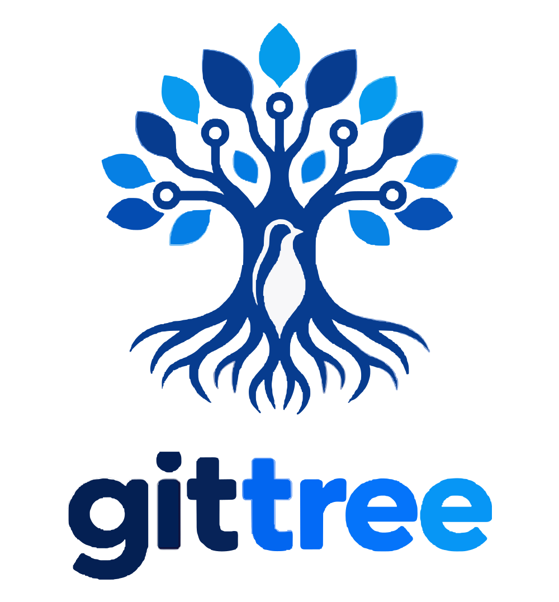

<div align="center">
  <picture>
    <source media="(prefers-color-scheme: dark)" srcset="branding/logo-dark.svg" />
    
  </picture>
  <br />
  <p><strong>A high-performance desktop Git client for Linux built around a real-time submodule workspace.</strong></p>

  <p>
    <a href="LICENSE"></a>
    
    
    
    
  </p>
</div>

---

GitTree combines the daily repository loop of classic Git GUIs (Sourcetree parity: line-level staging, interactive blame, visual rebase, reflog recovery) with a **submodule workspace** engineered for complex superprojects: a live, consolidated matrix answering what state every submodule is in right now across branches, recorded commits, remotes, and dirty working trees.

## Key Features

### 🌲 Submodule Workspace (The Differentiator)
- **Live State Matrix**: One consolidated view showing checked-out branch, divergence from the superproject gitlink, upstream tracking divergence, dirty files count, and staleness of the last fetch across all submodules.
- **Concurrent Network Refresh**: Fetches 25+ remote repositories in parallel using a bounded worker pool in seconds rather than sequential minutes.
- **Bulk Coordinated Actions**: Multi-select checkout, fetch, pull, and gitlink reset across selections with dirty-tree safety checks and per-submodule result reporting.
- **Atomic Gitlink Bumps**: Advance recorded submodule commits in the superproject with one action, guarded by unreachable-commit checks.

### ⚡ Core Daily Git Workflow
- **Precision Staging**: File-level, hunk-level, and line-level staging and unstaging powered by surgical patch construction.
- **Interactive Blame**: Commit attribution blocks with a "Blame before this" action to navigate back through parent revisions past bulk reformats.
- **Graph & History**: Virtualized commit graph with branch collapse, intra-line word-level diffs, and fast regex content search.
- **Operations & Safety**: Branch and tag management, guarded merge/rebase/cherry-pick with dirty-tree refusal, and first-class **Reflog Recovery**.
- **Audit & Transparency**: Every executed Git command, duration, exit code, and verbatim stderr is recorded in the Operation Log.

### 🎨 Themes & Desktop Integration
- **Bundled Community Themes**: Ships out-of-the-box with **Catppuccin Mocha**, **Nord**, **Tokyo Night**, **Gruvbox Dark**, **Dracula**, and **Solarized Dark**.
- **Live Desktop Sync**: In "Follow Desktop" mode, GitTree automatically detects and hot-reloads desktop palette updates (`colors.toml` / portals) without restarting.
- **Custom User Themes**: Hand-author custom themes as plain TOML files in `~/.config/gittree/themes/`.
- **Accessibility**: 100% token-based styling meeting WCAG AA contrast standards, reduced motion compliance, and fully usable at 200% text scale.

### 🔒 Privacy & Offline Guarantees
- **Zero Telemetry**: No outbound network requests at startup or idle, no analytics, no crash reporting, and no background tracking.
- **100% Offline Usability**: Every local capability operates smoothly without internet; remote operations fail fast with descriptive network errors.
- **Safe by Default**: Background watchers and status scans are strictly read-only by construction; writing commands are executed only on explicit user actions.

---

## Installation & Launch

### Arch Linux

Install the pre-built package:
```bash
sudo pacman -U packaging/arch/gittree-1.0.0-1-x86_64.pkg.tar.zst
```

Or build from the included `PKGBUILD`:
```bash
cd packaging/arch
makepkg -si
```

### AppImage

Download or build the standalone AppImage, make it executable, and run:
```bash
chmod +x GitTree_1.0.0_amd64.AppImage
./GitTree_1.0.0_amd64.AppImage
```

### CLI Opening

Open any repository or submodule superproject directly from your terminal:
```bash
gittree /path/to/my-repo
```

---

## Building from Source

### Prerequisites
- **Git** ≥ 2.43
- **Rust** stable (edition 2021)
- **Node.js** ≥ 20 & **pnpm** ≥ 9
- **Linux libraries**: `libwebkit2gtk-4.1-dev`, `libgtk-3-dev`, `libayatana-appindicator3-dev`, `librsvg2-dev`

### Development

```bash
# Install frontend dependencies
pnpm --dir frontend install

# Run frontend dev server and Tauri application
pnpm --dir frontend dev &
cargo run -p gittree
```

### Production Build

```bash
pnpm --dir frontend build
cargo build --release -p gittree
```

---

## Testing & Quality Assurance

GitTree enforces strict release budgets and comprehensive test coverage across the workspace:

```bash
# Workspace unit and integration tests (188+ tests)
cargo test --workspace

# Performance fixtures (synthetic 25-submodule, 100k-commit, 10k-dirty trees)
cargo test --workspace -- --ignored

# Frontend tests & design-token linter
pnpm --dir frontend test
pnpm --dir frontend lint:tokens
pnpm --dir frontend exec tsc -b
```

### Automated Release Verification Gates

Before any release artifact is published, automated verification scripts assert packaging integrity, memory footprint, and privacy guarantees:

```bash
bash scripts/verify-packaging.sh         # AppImage and Arch package launch verification
bash scripts/verify-release-budgets.sh   # Binary size (<=40MB) and idle memory (<=250MB PSS) gate
bash scripts/verify-no-telemetry.sh      # Zero outbound network socket verification
bash scripts/verify-offline-usability.sh # Network-isolated namespace execution check
```

---

## Repository Layout

```text
├── crates/
│   ├── git-process/      # Bounded worker pool, argv-only Git execution, read-only allowlist
│   └── repo-state/       # State models for repositories, submodules, staging, and history
├── src-tauri/            # Tauri 2 backend: commands, desktop theme watcher, settings
├── frontend/             # Solid.js + TypeScript UI with token-only styling
├── themes/               # Bundled community themes (Catppuccin, Nord, Tokyo Night, etc.)
├── packaging/            # Arch Linux PKGBUILD, desktop entries, and icons
├── branding/             # Vector brand assets, responsive logos, and usage guidelines
└── docs/                 # Detailed documentation
```

## Documentation

- [User Guide](docs/USER_GUIDE.md) — Comprehensive guide covering installation, submodule matrix workflows, theme authoring, keybindings, and settings.
- [Sourcetree Parity Matrix](docs/SOURCETREE_PARITY_MATRIX.md) — Detailed feature parity matrix and architectural comparison against Sourcetree.
- [Brand Guidelines](branding/README.md) — Logo rules, color codes, and raster export instructions.

---

## License

GitTree is free and open-source software licensed under the [MIT License](LICENSE).
